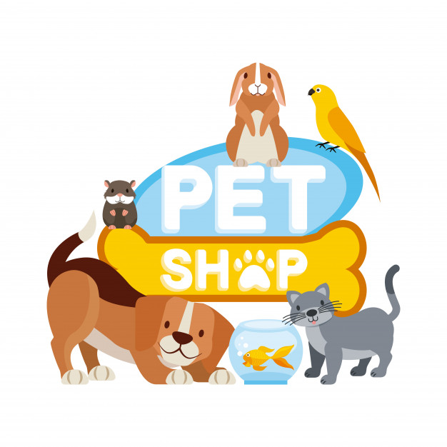

<h1 align="center">
    
</h1>

<h1 align="center">Pet Feliz - Happy Pet</h1>
<h5 align="center">Status: Concluido</h5>

<h2>Sumário</h2>

<ul>
    <li><a href="">Sobre</a></li>
    <li><a href="">Features</a></li>
    <li><a href="">Demonstração da aplicação</a></li>
    <li><a href="">Pré-requisitos e como rodar a aplicação</a></li>
    <li><a href="">Tecnologias utilizadas</a></li>
    <li><a href="">Contribuições</a></li>
    <li><a href="">Autor</a></li>
</ul>

<h2>💻 Sobre</h2>

Aplicação frontend para uma loja de adoção de animais de estimação, onde é possivel registrar animais para adoção ou adotar um animal. A  interface foi feita de acordo com o <a href="https://www.figma.com/file/LqXkNjwFOvwP4cxRJn7Rk7/Untitled">protótipo</a> criado no figma.

<h2>📝 Features</h2>

- [x] Tela de login
- [x] Telas de cadastro de usuário
- [x] Telas de cadastro de pet
- [x] Tela de informações do pet
- [x] Tela de usuário logado

<h2>🎥 Demonstração da aplicação</h2>

<h2>📀 Pré-requisitos e como rodar a aplicação</h2>
1- Clone este repositório [$ git clone https://github.com/PatrickGuilherme/HappyPet]
2- Acesse a pasta do projeto no terminal/cmd [$ cd petfeliz]
3- Instale as dependências [$ yarn install]
4- Adicione $ yarn add react react-dom
5- Inicie com $ yarn start
7- A aplicação irá iniciar

<h2>🔨Tecnologias utilizadas</h2>

As seguintes ferramentas foram utilizadas na construção do projeto:

<ul>
    <li>HTML5</li>
    <li>CSS3</li>
    <li>Javascript</li>
    <li>React JS</li>
</ul>

<h2>👦 Autor</h2>
<h4>PATRICK GUILHERME DA SILVA</h4>

E-mail: patrick.guilhermedasilva@gmail.com

Linkedin: www.linkedin.com/in/patrick-gs

